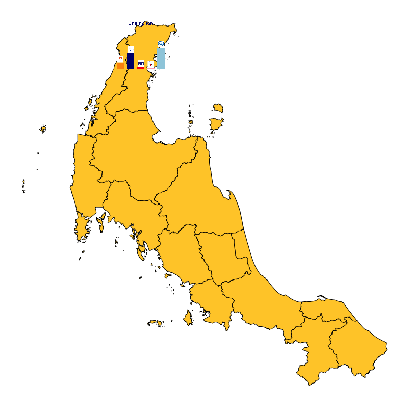
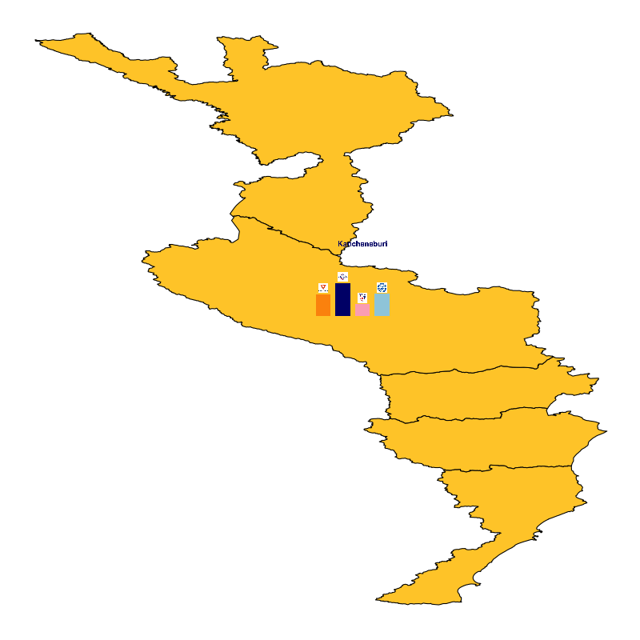
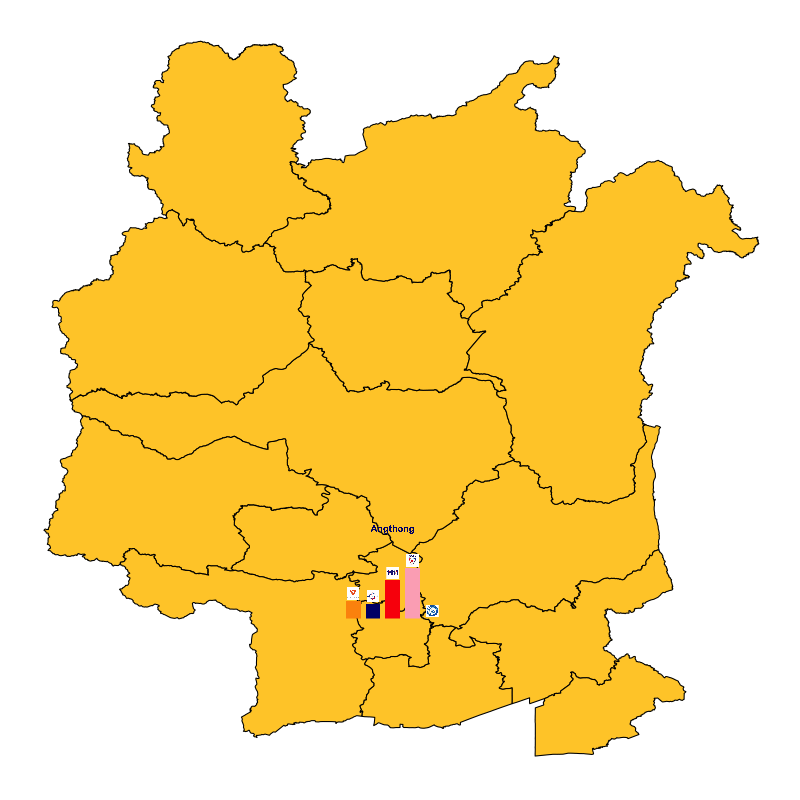
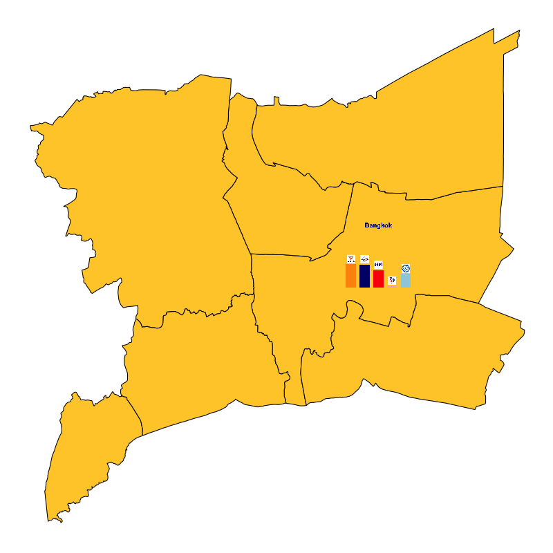
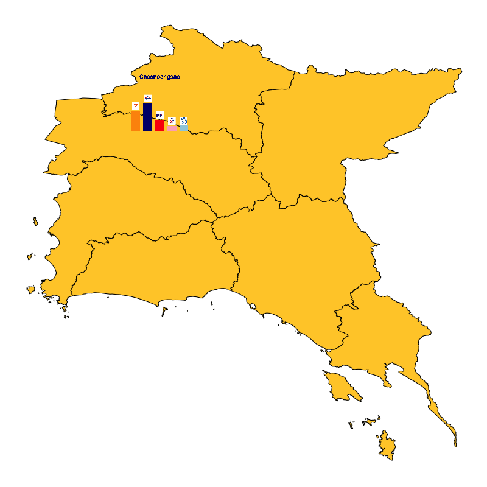
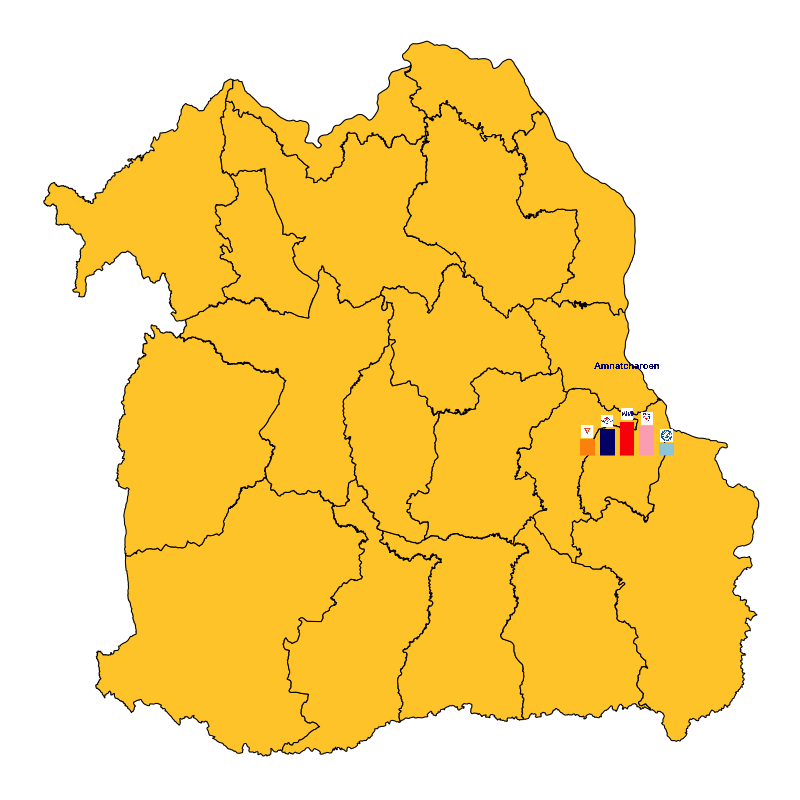
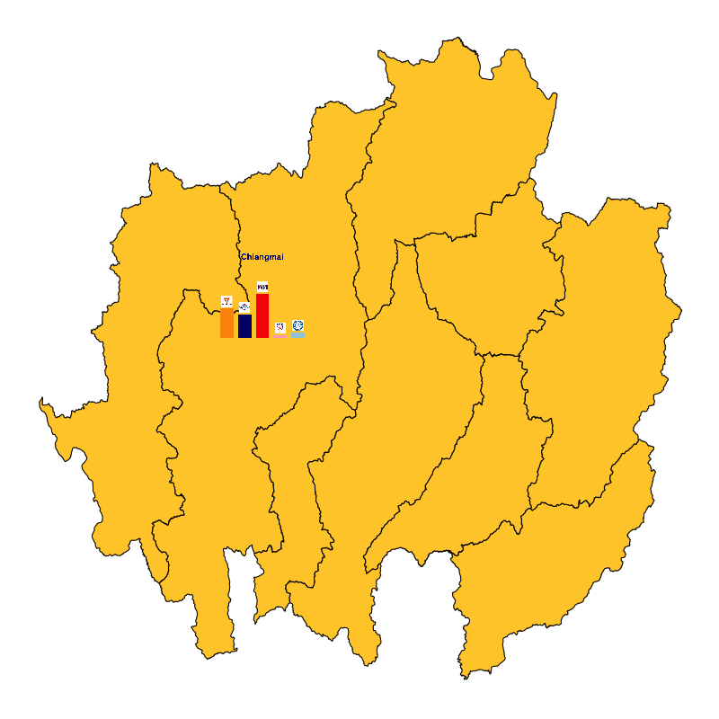

# Generations and Thailand's 2019 Election

ในขณะที่พรรคการเมืองต่างๆยังคงวุ่นอยู่กับการจัดตั้งรัฐบาล ในบทความนี้เรามาลองใช้ Data Science แบบง่ายๆ เพื่อหาคำอธิบายปรากฎการณ์บางอย่างจากผลการเลือกต้ังที่เพิ่งผ่านไปหมาดๆ ร่วมกับข้อมูลสาธารณะที่สามารถหาได้จากอินเตอร์เน็ต รวมถึงการทำ Data Visualization แบบสวยๆและน่าจะมีประโยชน์ต่อผู้ที่สนใจ

ปรากฎการณ์ที่ผมพูดถึงในที่นี้ ผมกำลังพูดถึงคำว่า `คนรุ่นใหม่` และ `คนรุ่นเก่า` ซึ่งเป็นคำที่มีการอ้างถึงและหลายๆท่านน่าจะได้ยินหลายๆครั้งในช่วงการหาเสียงในการเลือกตั้งครั้งที่ผ่านมา รวมถึงบทความวิเคราะห์ต่างๆที่เริ่มมีออกมาหลังการเลือกต้ัง

ในหลายบทความมีการพูดถึงบทบาทของ `คนรุ่นใหม่` ที่น่าจะส่งผลกระทบหรือแม้แต่จะเป็นตัวแปรสำคัญต่อผลการเลือกตั้งครั้งที่ผ่านมา หรือแม้แต่การส่งผลต่อยุทธศาสตร์การหาเสียงในการเลือกตั้งครั้งนี้ ที่พรรคการเมืองหลายพรรคตั้งใจเจาะกลุ่มคนรุ่นใหม่ ซึ่งแน่นอนว่าการวิเคราะห์ของบทความต่างๆเหล่านี้มีการตั้งสมมติฐานบางอย่าง ซึ่งในหลายๆครั้งไม่ได้เอ่ยถึงอย่างชัดเจนในการวิเคราะห์ หรือแม้แต่อาจจะเป็นความเชื่อส่วนบุคคลของผู้เขียนบทความเหล่านั้นเอง 

ตัวอย่างสมมติฐาน (หรือความเชื่อ) ที่ผมรู้สึก (อาจจะรู้สึกคนเดียว ^ ^!) เวลาอ่านบทความวิเคราะห์ต่างๆ คือ คะแนนเสียงที่พรรคการเมืองพรรคใหม่พรรคหนึ่งได้มาส่วนใหญ่น้ัน น่าจะมาจากเสียงของคนรุ่นใหม่ ?!? ซึ่งเป็นเหตุให้ผมอยากลองทดสอบข้อสมมติฐานหรือความเชื่อเหล่านี้ในการเลือกตั้งคร้ังที่ผ่านมา

Interactive visualization ต่อไปนี้ แสดงการวิเคราะห์อย่างง่ายด้วย Linear Regression เพื่อประมาณความสัมพันธ์ระหว่างสัดส่วน (%) ของคะแนนเสียงที่แต่ละพรรคได้รับในระดับจังหวัด กับ สัดส่วน (%) ของ `คนรุ่นใหม่` ต่อประชากรผู้มีสิทธิ์ออกเสียงทั้งหมดในจังหวัดนั้นๆ ซึ่งผู้อ่านสามารถกำหนดช่วงอายุ เพื่อนิยามคำว่า `คนรุ่นใหม่` ได้เอง

<br/>
<p align="center">
<iframe src="figures/plotly.html" width="1200" height="450" frameBorder="0"></iframe>
</p>
<br/>

ผลการประมาณในเบื้องต้น ให้ข้อสังเกตว่า มีเพียงพรรคประชาธิปัตย์และพรรคภูมิใจไทย (จากท้ังห้าพรรคการเมืองที่นำมาวิเคราะห์) เท่านั้น ที่คะแนนเสียงที่ได้รับเป็นไปในทิศทางเดียวกันกับสัดส่วนของประชากรที่ถูกนิยามว่าเป็น `คนรุ่นใหม่` ซึ่งข้อสังเกตดังกล่าวก็ยังคงไม่มีการเปลี่ยนแปลง ถึงแม้ว่าเราจะปรับเปลี่ยนช่วงความกว้างของนิยามคำว่า `คนรุ่นใหม่` ในขณะที่พรรคที่เหลืออีกสามพรรค คือ พรรคพลังประชารัฐ พรรคเพื่อไทย และพรรคอนาคตใหม่ นั้น ผลการประมาณในเบื้องต้น ให้ข้อสังเกตว่า คะแนนเสียงที่ได้รับมานั้น มีแนวโน้มที่จะมาจากกลุ่มผู้มีิสิทธิ์ในช่วงอายุอื่นๆ ที่ `ไม่ใช่` กลุ่มคนรุ่นใหม่

`
** หมายเหตุ: เนื่องจากการผลการประมาณค่า Regression ในที่นี้ ไม่ได้ control ปัจจัยที่อาจส่งผลต่อการเลือกของผู้มีสิทธิ์ เช่น ตัวผู้สมัคร หรือความแตกต่างทางเศรษฐกิจและสังคมของผู้มีสิทธิ์ในแต่ละเขตการเลือกต้ัง ผลการวิเคราะห์ที่ได้ในที่นี้ จึงเป็นเพียงแค่ข้อสังเกตเบื้องต้นเท่าน้ัน ไม่่อาจเป็นข้อสรุปหรือนำไปใช้อ้างอิงใดๆได้ **
`

### ** รายละเอียดขั้นตอนในการเลือกตัวแปรและการเตรียมข้อมูล (เฉพาะขั้นตอนที่สำคัญ) **

- ในเบื้องต้น ผมใช้ผลการเลือกต้ังแบบ 100% ที่ประกาศบน website ของสำนักงานคณะกรรมการการเลือกต้ัง (กกต.) [Download "HERE"](https://www.ect.go.th/ewt/ewt/ect_th/download/article/article_20190328165029.pdf) ซึ่งอยู่ในรูปแบบของ PDF

- จากนั้นทำการ convert เอกสาร PDF ให้เป็น csv หรือ excel format โดยใช้บริการ converter ของ website ต่างๆที่หาได้ง่ายๆบนอินเตอร์เน็ต (ซึ่งแน่นอนว่า มีข้อจำกัดหลายๆอย่างเช่น ลิมิตจำนวนหน้าหรือขนาดไฟล์ในการ convert แต่ละคร้ัง)

- ความยากลำบากทีเกิดขึ้นกับข้อมูลที่ convert มาจากไฟล์ PDF โดยเฉพาะข้อมูลที่มีบางส่วนเป็นภาษาไทย ก็คือ ความไม่สมบูรณ์ของชื่อผู้สมัครและชื่อพรรคการเมือง เช่น `พลังประชารัฐ` จะกลายเป็น `พลงประชารฐ` เป็นต้น ด้วยเหตุนี้ จึงมีความจำเป็นต้องมีการทำ data manipulation เพื่อให้ชื่อต่างๆมีความถูกต้อง โดยชื่อพรรคน้ัน คงไม่มีปัญหาอะไรในการแก้ไขชื่อพรรคแบบ manual เนื่องจากจำนวนพรรคมีไม่มากนัก (อีกเหตุผล ที่มีความจำเป็นจะต้องลงทุนแก้ไขแบบ manual ก็คือ การสร้าง linkage ที่จะใช้เชื่อมข้อมูลกับข้อมูลที่ได้จากการ Scrape นอกเหนือไปจากตัวแปรเขตการเลือกตั้ง เพื่อให้แน่ใจว่า ชื่อของผู้สมัครจะอยู่ในตำแหน่งที่ถูกต้อง หลังจากการ Join) ดังน้ัน ผมจึงทำการรวบรวมรายชื่อพรรคการเมืองทุกพรรคที่ลงเลือกต้ังในครั้งนี้ และจัดทำออกมาเป็น list structure แต่ในส่วนของรายชื่อผู้สมัครน้ัน คงเป็นไปไม่ได้ที่จะแก้ไขชื่อผู้สมัครทุกคนแบบ manual เนื่องจากผู้สมัครท้ังประเทศมีเป็นจำนวนมาก ด้วยเหตุนี้ จึงต้องหาตัวช่วยจากแหล่งข้อมูลอื่น

- ในที่นี้ ผมหาข้อมูลชื่อ-นามสกุล และพรรคที่สังกัดของผู้สมัครแต่ละคนในแต่ละเขตการเลือกต้ังของประเทศไทย โดยการ Scrape ข้อมูลจาก website ที่มีการรายงานผลการเลือกต้ังในช่วงการเลือกต้ังที่ผ่านมา ซึ่งในที่นี้ผมเลือก [website รายงานผลการเลือกต้ังของช่อง 3](http://www.ch3thailand.com/%E0%B9%80%E0%B8%A5%E0%B8%B7%E0%B8%AD%E0%B8%81%E0%B8%95%E0%B8%B1%E0%B9%89%E0%B8%8762?page=total) เนื่องจากมีรูปแบบของ URL ที่ค่อนข้างเอื้อต่อการ Scrape ข้อมูล

### **Guiding R-Script สำหรับ Scrape ข้อมูลจาก website รายงานผลการเลือกตั้งของช่อง 3 มีดังต่อไปนี้**

```r
library(rvest); library(httr); library(RCurl); library(RSelenium)
library(readxl); library(data.table); library(dplyr)

rD <- rsDriver(browser = "firefox", iedrver = NULL, verbose = TRUE, check = TRUE, extraCapabilities = fprof)
remDr <- rD$client
remDr$setTimeout(type = "page load", milliseconds = 15000)

TH_election <- data.table()
summary <- data.table()
for (k in c(1:nrow(iso))) {
  #Page of interest
  page <- paste0("http://www.ch3thailand.com/%E0%B9%80%E0%B8%A5%E0%B8%B7%E0%B8%AD%E0%B8%81%E0%B8%95%E0%B8%B1%E0%B9%89%E0%B8%8762?page=provice&id=",iso$iso[k])
  
  remDr$navigate(page)
  Sys.sleep(15)
  # Path of interest
  form <- remDr$findElements(using = "css", value = "div.table-vote.vote-province")
  
  # Election zone
  where <- remDr$findElements(using = "xpath", value = "//*/h3/span")
                 
  for (j in c(1:length(form))) {
    df <- form[[j]]$getElementText()
    mix <- gsub("\n", "_", df[[1]])
    vote <- strsplit(mix, split = "_") %>% data.frame(.)
    vote[[1]] <- as.character(vote[[1]])
    result <- vote[-1, ] %>% strsplit(., split = " ")
    area <- where[[j]]$getElementText()
    
    final <- data.table()
    for (i in c(1:length(result))) {
      pull <- strsplit(result[[i]], split = " ")
      ready <- data.frame("no" = pull[[1]], "name" = paste0(pull[[2]]," ",pull[[3]]," ",pull[[4]]),
                          "party" = pull[[length(pull)-1]], "vote" = pull[[length(pull)]], "area" = area[[1]])
      final <- rbind(final,ready)
      rm(pull,ready)
    }
    TH_election <- rbind(TH_election,final)
    rm(df,mix,vote,result,area,final)
  }
  rm(form)
  
  cmount <- remDr$findElements(using = "css", value = "section.row.CountingVotes")
  df <- count[[1]]$getElementText()
  mix <- strsplit(df[[1]], split = "\n")
  sum <- data.frame("voter" = mix[[1]][2], "no_vote" = mix[[1]][4], "fail" = mix[[1]][6])
  summary <- rbind(summary,sum)
  
  rm(page)
}

rm(rD,remDr)
remDr$close()
closeAllConnections()
```

**หมายเหตุ:**

**"iso$iso[k]" ใน R-script ข้างต้น หมายถึง รหัสสำหรับประเทศไทยตามมาตรฐาน ISO 3166-2e ([Wikipedia](https://th.wikipedia.org/wiki/ISO_3166-2:TH)) สำหรับจังหวัด k ใน dataframe ชื่อ "iso" ที่ได้เตรียมไว้แล้วล่วงหน้า**

- จากนั้นทำการ Join ข้อมูลกับข้อมูลที่ convert จาก PDF ผลการนับคะแนน 100% ของ กกต. เราก็จะได้ Dataframe ที่สมบูรณ์ของผลการเลือกต้ัง 62 

- ต่อมา เนื่องจากเราต้องการวิเคราะห์บทบาทของเสียงของ "คนรุ่นใหม่" ซึ่งแน่นอนว่า เราคงไม่สามารถหาข้อมูลที่แท้จริงว่าผู้มาใช้สิทธิ์คนไหนเลือกพรรคใด (ถ้าใครมีข้อมูลหรือรู้ช่องทาง รบกวนช่วยชี้ช่อง ด้วยครับ) ในที่นี้ ผมจึงใช้สัดส่วนจำนวนประชากรคนรุ่นใหม่ต่อประชากรผู้มีสิทธิ์ทัั้งหมดในเขตเลือกต้ัง มาเป็นตัวแปรในการวิเคราะห์แทน ซึ่งข้อมูลดังกล่าว สามารถ Scrape ได้ website ของกรมการปกครอง

### **Guiding R-Script สำหรับ Scrape ข้อมูลจาก website ของกรมการปกครอง มีดังต่อไปนี้**

```r
library(rvest); library(httr); library(RCurl); library(RSelenium)
library(data.table); library(dplyr); library(readxl); library(stringr)

rD <- rsDriver(browser = "firefox", iedrver = NULL, verbose = TRUE, check = TRUE, extraCapabilities = fprof)
remDr <- rD$client
remDr$setTimeout(type = "page load", milliseconds = 30000)

for (y in c(40:61)) { # Two last digits of each Buddhist Era i.e. 2540--2561
  for (p in c(1:nrow(iso))) { # Province's ISO code number
    page <- paste0("http://stat.bora.dopa.go.th/stat/xstat/new/",y,"12/",y,"12cc",iso$iso[p],".txt")
    remDr$navigate(page)
    Sys.sleep(5)
    # Get the whole content
    remDr$getPageSource()
    content <- remDr$findElement(using = "xpath", value = "//pre")
    level1 <- content$getElementText()[[1]]
    result <- strsplit(level1, split = "\n") %>% 
      do.call(cbind, .) %>% strsplit(., split = "|", fixed = TRUE) %>% 
      do.call(rbind, .) %>% data.table(.)
    
    # Renaming the columns
    colnames(result)[1] <- "desc"
    colnames(result)[seq(3,205,2)] <- rep(paste0("fmale_",0:101))
    colnames(result)[seq(2,204,2)] <- rep(paste0("male_",0:101))
    colnames(result)[206:220] <- c("male_tdob","fmale_tdob","total_tdob",
                                   "male_xhouse","fmale_xhouse","total_xhouse",
                                   "male_other_nat","fmale_other_nat","total_other_nat",
                                   "male_move","fmale_move","total_move",
                                   "male_tot","fmale_tot","tot_tot")
    
    # Save the file to assigned directory using province name (result[1,1]) & Buddhist Era
    save(result, file = paste0("/Path/to/your/directory/",result[1,1],"_",paste0(25,y),".rda"))
    rm(content,level1,result)
  }
}

remDr$close()
closeAllConnections()
rm(remDr,rD)

```

- ณ ตอนนี้ เราจะได้ข้อมูลที่เราต้องการพร้อมแล้ว ต่อไป เราจะลองทำ Data visualization กับข้อมูลทั้งสองส่วนที่เราได้เตรียมไว้
- ในเบื้องต้น เราจะเริ่มด้วยการวิเคราะห์คะแนนเสียงที่แต่ละพรรคได้รับในระดับจังหวัด เพื่อสะดวกต่อการทำ Data visualization (ความเป็นจริง คือ ยังคิดรูปแบบที่ถูกใจเพื่อแสดงผลท้ัง 350 เขต ไม่ได้ ^ ^)
- และเพื่อให้รูปที่แสดงออกมามีรายละเอียดที่ครบถ้วนพอสมควร ผมจึงเลือกแสดงในเบื้องต้นแค่เพียง 5 พรรคแรกที่ได้คะแนนเสียงรวมสูงที่สุด คือ พลังประชารัฐ อนาคตใหม่ เพื่อไทย ภูมิใจไทย และประชาธิปัตย์ ดังแสดงใน Fig.1 

### **Guiding R-Script สำหรับการทำ Data Visualization ข้อมูลผลการเลือกตั้ง มีดังต่อไปนี้**

```r
library(data.table); library(dplyr); library(ggplot2); library(gganimate); library(tweenr)

# Subset dataframe
big5 <- subset(vote_by_prv[,c("prv_crect","party_crect","rank","vote_pct")], party_crect %in% c("พลังประชารัฐ","อนาคตใหม่","เพื่อไทย","ภูมิใจไทย","ประชาธิปัตย์"))

# Define directory of logo
big5$image <- paste0("/Path/To/Your/Directory/of/logo/",big5$ชื่อพรรค,".jpg")

# Create facet plot
# 1. Open jpeg file
jpeg(paste0('/Path/To/Your/Directory/filename.jpg'), width = 16000, height = 9000, units = 'px', res = 1000)
# 2. Create a plot
ggplot(data = big5, mapping = aes(x = party_crect, y = vote_pct, fill = party_crect)) +
  geom_col(position=position_dodge(), width = 0.75) +
  geom_image(aes(image = big5$image, x = party_crect, y = vote_pct+6), size=0.125, by = "width") +
  facet_wrap(~ prvEN, ncol = 11) +
  theme(legend.position = "none", axis.text.x = element_blank()) +
  scale_fill_manual(values = c("อนาคตใหม่" = "orange", "พลังประชารัฐ" = "darkblue", "เพื่อไทย" = "red", "ภูมิใจไทย" = "pink", "ประชาธิปัตย์" = "lightblue")) +
  scale_y_continuous(name = "% of vote received", expand = c(0, 0), limits = c(0, 80)) +
  xlab("Party")
# 3. Close the file
dev.off()

```


<figcaption>Fig.1 Facet Plot of Selected 5 Parties across Thailand</figcaption>
<br/><br/>

- อีกรูปแบบหนึ่งที่น่าจะเป็นประโยชน์ต่อการทำ Data Visualization ก็คือ การแสดงข้อมูลในเชิงพื้นที่ซึ่งช่วยให้เราสามารถวิเคราะห์บริบทที่แตกต่างกันของแต่ละพื้นที่ เพื่อให้การแสดงข้อมูลมีความน่าสนใจมากยิ่งขึ้น
- Fig.2 แสดง (Static) Data Visualization โดย Link ข้อมูลผลการเลือกตั้งเข้ากับ Polygon ของจังหวัด และเพื่อเพิ่มความน่าสนใจ จึงลองสร้าง Animation ที่แสดงผลการเลือกตั้งในระดับจังหวัดเช่นเดียวกัน ดังแสดงใน Fig.3
- ในส่วนของ Shapefile ของจังหวัดทั้งหมดของประเทศไทยนั้น ผมทำการ Download จาก ArcGIS REST Services Directory ของ GISTDA และแปลงเป็น SpatialPolygonDataFrame

*หมายเหตุ: เพื่อประหยัดพื้นที่ในบทความ ผู้เขียนขอข้ามขั้นตอนการเตรียมข้อมูลอย่างละเอียด*

### **Guiding R-Script สำหรับการทำ Data Visualization และ Data Animation ข้อมูลผลการเลือกตั้งเชิงพื้นที่ มีดังต่อไปนี้**

```r
# Create function to plot each region separately
region <- c("north","west","east","neast","central","south","metro")
plot_by_region <- function(region,width,height,offset) {
  zone = region
  ggplot() + 
    geom_polygon(data = subset(prv_spX, region == zone), #'prv_spX' dataframe is created from the shapefile downloaded from GISTDA Portal
                 aes(x = long, y = lat, group = group), fill = '#FFCC33', colour = 'black') +
    geom_image(data = subset(center, region == zone), #'center' dataframe contains the centroids of all provinces derived from the shapefile
               aes(image = image, x = lon, y = lat + offset), size = 0.115, by = "width") +
    theme(legend.position = "none"
          , rect = element_rect(fill = "transparent") # all rectangles
          , text = element_blank()
          , line = element_blank()
          , panel.background = element_rect(fill = "transparent", color = NA) # bg of the panel
          , plot.background = element_rect(fill = "transparent", color = NA) # bg of the plot
          , panel.grid.major = element_blank() # get rid of major grid
          , panel.grid.minor = element_blank() # get rid of minor grid
          , legend.background = element_rect(fill = "transparent") # get rid of legend bg
          , legend.box.background = element_rect(fill = "transparent") # get rid of legend panel bg
    )
  ggsave(paste0("/Path/to/Your/Directory/filename_",zone,".png"), 
         device = "png", width = width, height = height, units = "mm", bg="transparent")
}

for (i in c(1:length(region))) {
    if (i != 7){
      plot_by_region(region = region[[i]], width = 800, height = 800, offset = 0.2) #All regions except metropolitan
    } else {
        plot_by_region(region = region[[i]], width = 800, height = 800, offset = 0.025) #Metropolitan region only
    }
}

# Create function to animate each region separately
ani_byRegion <- function(region, offset, fps) {
  zone = region
  p2 <- ggplot(data = subset(center, region == zone)) + 
  geom_polygon(data = subset(main_spX, region == zone), 
               aes(x = long, y = lat, group = group), fill = '#FFCC33', colour = 'black') +
  geom_image(data = subset(center, region == zone), 
             aes(image = image, x = lon, y = lat+offset), size = 0.15, by = "width") +
  transition_states(states = prvEN) +
  view_follow() +
  theme(legend.position = "none"
        , rect = element_rect(fill = "transparent") # all rectangles
        , text = element_blank()
        , axis.title.x = element_blank()
        , axis.text.x = element_blank()
        , axis.ticks.x = element_blank()
        , axis.title.y = element_blank()
        , axis.text.y=element_blank()
        , axis.ticks.y=element_blank()
        , line = element_blank()
        , panel.background = element_rect(fill = "transparent", color = NA) # bg of the panel
        , plot.background = element_rect(fill = "transparent", color = NA) # bg of the plot
        , panel.grid.major = element_blank() # get rid of major grid
        , panel.grid.minor = element_blank() # get rid of minor grid
        , legend.background = element_rect(fill = "transparent") # get rid of legend bg
        , legend.box.background = element_rect(fill = "transparent") # get rid of legend panel bg
  )
  p2.1 <- animate(p2, fps = fps, height = 800, width = 800)
  anim_save(paste0("/Path/to/Your/Directory/filename_",zone,".gif"), p2.1)
}
```

<table><tr>
<td> <figcaption>(a) Southern Region</figcaption></td>
<td> <figcaption>(b) Western Region</figcaption></td>
<td> <figcaption>(c) Central Region</figcaption></td>
<td> <figcaption>(d) Metropolitan Region</figcaption></td></tr></table>
<br/><br/>
<table><tr>
<td> <figcaption><br/>(e) Eastern Region</figcaption></td>
<td> <figcaption><br/>(f) N-Eastern Region</figcaption></td>
<td> <figcaption><br/>(g) Northern Region</figcaption></td></tr></table>

<figcaption>Fig.2 Static Visualization of Mapped Election Results by Region</figcaption>
<br/><br/><br/>

<table><tr>
<td> <figcaption>(a) Southern Region</figcaption></td>
<td> <figcaption>(b) Western Region</figcaption></td>
<td> <figcaption>(c) Central Region</figcaption></td>
<td> <figcaption>(d) Metropolitan Region</figcaption></td></tr></table>
<br/><br/>
<table><tr>
<td> <figcaption>(e)<br/> Eastern Region</figcaption></td>
<td> <figcaption><br/>(f) N-Eastern Region</figcaption></td>
<td> <figcaption><br/>(g) Northern Region</figcaption></td></tr></table>

<figcaption>Fig.3 Animation of Mapped Election Results by Region</figcaption>
<br/><br/>

- ในส่วนของ Data visualization ของข้อมูลสัดส่วนจำนวนประชากรคนรุ่นใหม่ต่อประชากรผู้มีสิทธิ์ทั้งหมดในแต่ละจังหวัดประจำปี 2561 นั้น ผมตัดสินใจทำ Facet plot เช่นเดียวกันกับผลการเลือกตั้งข้างบน เพื่อสะดวกต่อการเปรียบเทียบ ดังแสดงใน Fig.4

### **Guiding R-Script สำหรับการทำ Data Visualization ข้อมูลสัดส่วนจำนวนประชากรคนรุ่นใหม่ มีดังต่อไปนี้**

```r
jpeg(paste0('/Volumes/SGunK/Research_Database/election2019/age_distribution_provinces.jpg'), width = 16000, height = 9000, units = 'px', res = 1000)
ggplot(data = melt_tot, mapping = aes(x = age, y = persons, fill = prvEN)) +
  geom_bar(stat = "identity", position=position_dodge(), width = 0.3) +
  facet_wrap(~ prvEN, ncol = 11) +
  theme(legend.position = "none") +
  ylab("Density (% of population of that age)")
dev.off()

```


<figcaption>Fig.4 Facet Plot of Age Distribution across Thailand</figcaption>
<br/><br/>

- ในส่วนสุดท้ายของบทความนี้ เราจะมาลองทำ Interactive Visualization ตามที่ได้แสดงไว้ในตอนต้นของบทความ เพื่อช่วยในการวิเคราะห์ผลการเลือกต้ังในเบื้องต้น<br/>

### **Guiding R-Script สำหรับการทำ Interactive Dashboard เพื่อการวิเคราะห์ผลการเลือกต้ังในเบื้องต้น มีดังต่อไปนี้**

```r
# Create function to aggregate the number of 'newgen' defined by user
age_range <- function(dummy,new,mid) {
  df <- dummy
  df$newgen <- rowSums(df[,1:which(colnames(df) == paste0("pct_tot_",new))])
  df$midgen <- rowSums(df[ ,which(colnames(df) == paste0("pct_tot_",new+1)) : which(colnames(df) == paste0("pct_tot_",mid))])  
  df$oldgen <- rowSums(df[ ,which(colnames(df) == paste0("pct_tot_",mid+1)) : which(colnames(df) == "pct_tot_101")])  
  gen_tot <- melt(data = df[,c("prvEN","newgen","midgen","oldgen")], id.vars = "prvEN", variable.name = "age", value.name = "persons")
  gen_tot$persons <- gen_tot$persons * 100
  colnames(gen_tot)[ncol(gen_tot)] <- "density"
  result <- merge(big5, gen_tot[which(gen_tot$age == "newgen"),c("prvEN","density","age")], by.x = "prvEN", by.y = "prvEN")
  result$newgen <- new
  return(result)
}
# Create possible range of 'newgen' definitions
gentotal <- data.frame()
for (i in c(30:45)) {
  gentot <- age_range(dummy = final_tot, new = i, mid = 60)
  gentotal <- rbind(gentotal,gentot)
}
# Create plotly interactive
gx <- highlight_key(gentotal) #key = ~party_crect)
popxelect <- ggplot(data = gx, mapping = aes(x = density, y = vote_pct, group = interaction(party_crect,newgen))) +
  scale_color_manual("พรรคการเมือง",values = c("อนาคตใหม่" = "orange", "พลังประชารัฐ" = "darkblue", "เพื่อไทย" = "red", "ภูมิใจไทย" = "pink", "ประชาธิปัตย์" = "lightblue")) +
  geom_smooth(aes(color = party_crect), method = "lm", formula = y ~ x, se = FALSE) +
  geom_ribbon(stat='smooth', method = "lm", formula = y ~ x, se=TRUE, alpha=0.1, aes(color = NULL)) +
  scale_x_continuous("สัดส่วนผู้มีสิทธิ์รุ่นใหม่ (NewGen) ต่อผู้มีสิทธิ์ทั้งหมดในจังหวัด (%)") + #Density of NewGen (NewGen Voters / Total Voters)
  scale_y_continuous("สัดส่วนคะแนนเสียงที่ได้รับ (%)") #% of votes received
#popxelect
filter <- bscols(
  widths = c(12, 12),
  filter_select("id","เลือกพรรคที่ต้องการวิเคราะห์", gx, ~party_crect),
  filter_checkbox("gen", "เลือกลิมิตของอายุสำหรับนิยามคำว่า 'NewGen' (18 ปี - xx ปี) ", gx, ~newgen, inline = TRUE)
)
bscols(widths = c(4,8),
       filter,
       ggplotly(popxelect, dynamicTicks = TRUE))

```
